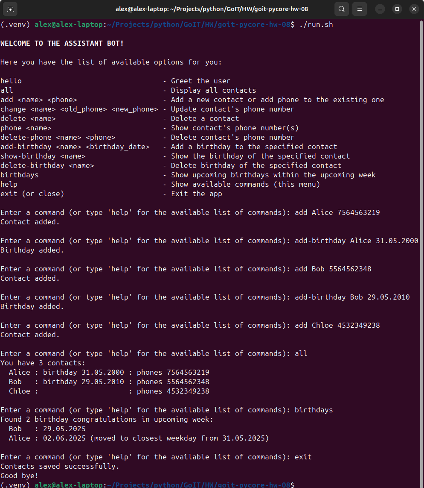

# Python Programming: Foundations and Best Practices 2.0 <!-- omit in toc -->

### [# goit-pycore-hw-08](https://github.com/topics/goit-pycore-hw-08) <!-- omit in toc -->

<p align="center">
  
</p>


## Serialization and copying of the objects in Python <!-- omit in toc -->

This task is a follow-up of the previous task **[CLI assistant bot](https://github.com/oleksandr-romashko/goit-pycore-hw-07)**, extended by adding saving the address book to disk and restoring it from disk using serializations implemented using [Pickle](https://docs.python.org/3/library/pickle.html).


### Table of Contents <!-- omit in toc -->
- [Project Setup \& Run Instructions](#project-setup--run-instructions)
  - [Prerequisites](#prerequisites)
  - [Setting Up the Development Environment](#setting-up-the-development-environment)
  - [Running the Project](#running-the-project)
- [Task Solution](#task-solution)
  - [Task description](#task-description)
  - [Solution](#solution)
- [Task requirements](#task-requirements)
  - [Task description](#task-description-1)
  - [Evaluation criteria](#evaluation-criteria)


### Project Setup & Run Instructions

#### Prerequisites

Before starting, ensure that you have the following installed:

* [Python 3.11+](https://www.python.org/downloads/) (Make sure python (`python --version` or `python3 --version`) and pip (`python -m pip --version` or `python3 -m pip --version`) are available in your terminal)
* [Git](https://git-scm.com/downloads) (optional, for version control)

#### <a name="setup-setting-up-environment"></a>Setting Up the Development Environment

1. **<a name="setup-clone-repository"></a>Clone (or copy) the Repository**

    If you haven't cloned the project yet, you can do so using:

    ```bash
    git clone https://github.com/oleksandr-romashko/goit-pycore-hw-08.git
    cd goit-pycore-hw-08
    ```

    or download zip archive with code directly [from the repository](https://github.com/oleksandr-romashko/goit-pycore-hw-08/archive/refs/heads/main.zip).

2. **<a name="setup-create-virtual-environment"></a>Create a Virtual Environment**

    * **Linux/macOS (using `bash` or `zsh`):**

      Run the setup.sh script:

      ```bash
      source setup.sh
      ```

      This will:
      * Create a virtual environment (`.venv`).
      * Activate the virtual environment.
      * Install dependencies listed in `requirements.txt`.
      * Set the `PYTHONPATH` for module imports.
      * Set-up pre-commit hook.

    * **Windows (using Command Prompt):**

      If you're using Command Prompt to set up your development environment, you can run the `setup.bat` script:

      ```cmd
      setup.bat
      ```
      This will:
      * Create a virtual environment (.venv).
      * Activate the virtual environment.
      * Install dependencies listed in requirements.txt.
      * Set the `PYTHONPATH` for module imports.
      * Set-up pre-commit hook.


#### <a name="setup-running-the-project"></a>Running the Project

Once your virtual environment is set up, you can run the application code.

* **<a name="setup-running-vs-code"></a>Running the project in VS Code**

  Once the virtual environment is activated and `PYTHONPATH` is set, you can run the project directly from VS Code. Make sure that your `settings.json` (in `.vscode` folder) is correctly set up, as discussed previously.

  VS Code will automatically use the virtual environment and set the correct `PYTHONPATH` if you've configured your settings properly.

  You can launch each task with preconfigured inputs via the debugger ([.vscode/launch.json](.vscode/launch.json)).

  Below is a mapping of launch configurations to their command-line equivalents. You can run them directly or through provided scripts:

* **<a name="setup-running-command-line"></a>Running the project from the Command Line**

  After setting up your virtual environment and setting the `PYTHONPATH`, you can run the project directly from the terminal.

 The command will run the script (please note, that for Linux/macOS you might use `python3` instead of `python` command):

  Command Handler Bot:
  ```bash
  python src/main.py
  ```

  or for alternative (data-driven mode):

  ```bash
  python src/main.py --alternative
  ```

* **<a name="setup-running-script"></a>Alternatively, you can use a script to run the project**

  * **On Linux/macOS (shell script)**:

    Run application with the script:
    ```bash
    ./run.sh
    ```

    or for alternative (data-driven mode):

    ```bash
    ./run_alternative.sh
    ```

    Make sure the shell scripts have execution permission by running (check it if previous step has issues):

    ```bash
    chmod +x ./run.sh
    ```

  * **On Windows (batch script)**:

    ```cmd
    run.bat
    ```

    or for alternative (data-driven mode):

    ```cmd
    run_alternative.bat
    ```


### Task Solution

#### <a name="assignment-task-description"></a>Task description

Added functionality for saving the address book to disk and restoring it from disk.

#### <a name="assignment-solution"></a>Solution

Solution for this assignment is located in the following files:
* [main.py](./src/main.py) class - main entry point, presentation layer. Loads previous app state (if any) and dispatches exiting application where app state saving is executed.
* [cli/command_handlers.py](./src/cli/command_handlers.py) - handler for load state and exit with saving commands.
* [services/contacts_manager.py](./src/services/contacts_manager.py) - stores instance of AddressBook instance, that is loaded in a lazy way. Has functions to invoke loading and saving on of AddressBook instance state using respective mechanisms from persistence layer.
* [persistence/file_handler.py](./src/persistence/file_handler.py) - handler for file loading and saving. Handles all errors and raises custom for persistence layer [PermissionError](./src/persistence/persistence_error.py).
* [persistence/pickle_io.py](./src/persistence/pickle_io.py) - exact implementation of app state serialization using [pickle](https://docs.python.org/3/library/pickle.html).

UML Class Diagram of the solution (created using [Star UML](https://staruml.io/) tool, source file is located [here](./assets/uml/class_diagram-star-uml.mdj)):


UML Sequence Diagram and estimation of unified generalized application flow (created using [Star UML](https://staruml.io/) tool, source file is located [here](./assets/uml/class_diagram-star-uml.mdj)):


Application screenshot:




### Task requirements

#### <a name="assignment-task-requirements"></a>Task description

Extend the functionality of the application from the previous solution and add functionality for saving the address book to disk and restoring it from disk.

Choose the `pickle` protocol for serializing and deserializing data, and implement methods that allow you to save all data to a file and load it from a file.

The main goal is to ensure that the application does not lose data after exiting and restores them from the file upon the next launch. The address book you worked on in the previous session should be preserved.

Implement functionality to save the state of the `AddressBook` to a file when the program closes, and restore its state when the program starts.

**Example code that might be useful:**

Serialization with pickle:

```python
import pickle

def save_data(book, filename="addressbook.pkl"):
    with open(filename, "wb") as f:
        pickle.dump(book, f)

def load_data(filename="addressbook.pkl"):
    try:
        with open(filename, "rb") as f:
            return pickle.load(f)
    except FileNotFoundError:
        return AddressBook()  # Return a new address book if the file is not found
```

Integration of saving and loading into the main loop:

```python
def main():
    book = load_data()

    # Main program loop

    save_data(book)  # Call before exiting the program
```

#### <a name="assignment-evaluation-criteria"></a>Evaluation criteria

1. The serialization/deserialization protocol is implemented using `pickle`.
2. All data must be saved upon exiting the program.
3. The address book must be restored in the application upon the next session, exactly as it was during the previous session.
