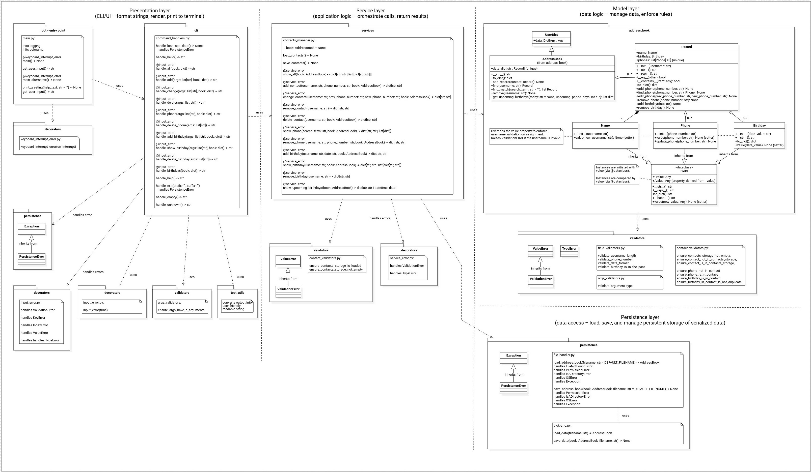
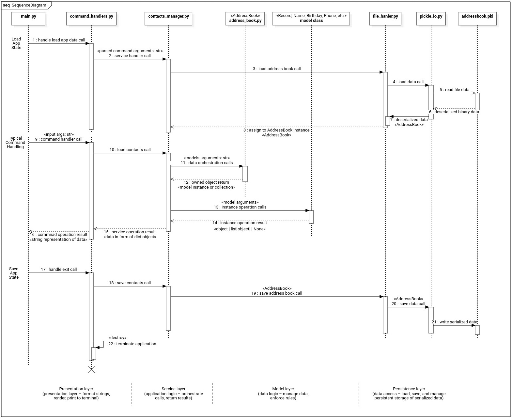
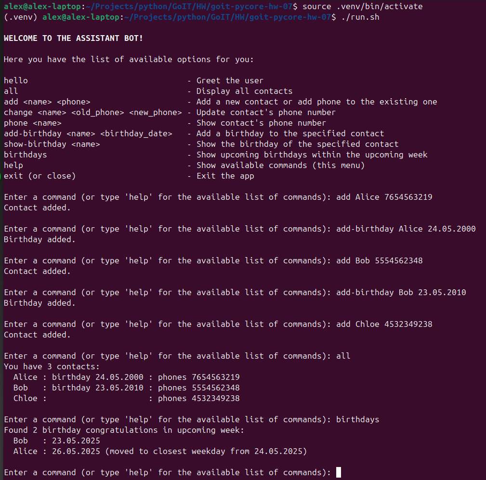

# Python Programming: Foundations and Best Practices 2.0

### [# goit-pycore-hw-07](https://github.com/topics/goit-pycore-hw-07)

<p align="center">
  
</p>


## Special methods for object manipulations

This task is a follow-up of the previous task **[CLI assistant bot](https://github.com/oleksandr-romashko/goit-pycore-hw-06)**, extended by adding storage of multiple phones and a birthday date in a contact.

<details>

<summary><h3 style="display: inline-block">Project Setup & Run Instructions</h3></summary>

##### Table of Contents
- [Python Programming: Foundations and Best Practices 2.0](#python-programming-foundations-and-best-practices-20)
    - [# goit-pycore-hw-07](#-goit-pycore-hw-07)
  - [Special methods for object manipulations](#special-methods-for-object-manipulations)
        - [Table of Contents](#table-of-contents)
      - [Prerequisites](#prerequisites)
      - [Setting Up the Development Environment](#setting-up-the-development-environment)
      - [Running the Project](#running-the-project)
      - [Task description:](#task-description)
      - [Solution:](#solution)
      - [Task requirements:](#task-requirements)
        - [Task 1](#task-1)
        - [Task 2](#task-2)
      - [Evaluation criteria:](#evaluation-criteria)

#### <a name="setup-prerequisites"></a>Prerequisites

Before starting, ensure that you have the following installed:

* [Python 3.11+](https://www.python.org/downloads/) (Make sure python (`python --version` or `python3 --version`) and pip (`python -m pip --version` or `python3 -m pip --version`) are available in your terminal)
* [Git](https://git-scm.com/downloads) (optional, for version control)

#### <a name="setup-setting-up-environment"></a>Setting Up the Development Environment

1. **<a name="setup-clone-repository"></a>Clone (or copy) the Repository**

    If you haven't cloned the project yet, you can do so using:

    ```bash
    git clone https://github.com/oleksandr-romashko/goit-pycore-hw-06.git
    cd goit-pycore-hw-06
    ```

    or download zip archive with code directly [from the repository](https://github.com/oleksandr-romashko/goit-pycore-hw-06/archive/refs/heads/main.zip).

2. **<a name="setup-create-virtual-environment"></a>Create a Virtual Environment**

    * **Linux/macOS (using `bash` or `zsh`):**

      Run the setup.sh script:

      ```bash
      source setup.sh
      ```

      This will:
      * Create a virtual environment (`.venv`).
      * Activate the virtual environment.
      * Install dependencies listed in `requirements.txt`.
      * Set the `PYTHONPATH` for module imports.
      * Set-up pre-commit hook.

    * **Windows (using Command Prompt):**

      If you're using Command Prompt to set up your development environment, you can run the `setup.bat` script:

      ```cmd
      setup.bat
      ```
      This will:
      * Create a virtual environment (.venv).
      * Activate the virtual environment.
      * Install dependencies listed in requirements.txt.
      * Set the `PYTHONPATH` for module imports.
      * Set-up pre-commit hook.


#### <a name="setup-running-the-project"></a>Running the Project

Once your virtual environment is set up, you can run the application code.

* **<a name="setup-running-vs-code"></a>Running the project in VS Code**

  Once the virtual environment is activated and `PYTHONPATH` is set, you can run the project directly from VS Code. Make sure that your `settings.json` (in `.vscode` folder) is correctly set up, as discussed previously.

  VS Code will automatically use the virtual environment and set the correct `PYTHONPATH` if you've configured your settings properly.

  You can launch each task with preconfigured inputs via the debugger ([.vscode/launch.json](.vscode/launch.json)).

  Below is a mapping of launch configurations to their command-line equivalents. You can run them directly or through provided scripts:

* **<a name="setup-running-command-line"></a>Running the project from the Command Line**

  After setting up your virtual environment and setting the `PYTHONPATH`, you can run the project directly from the terminal.

 The command will run the script (please note, that for Linux/macOS you might use `python3` instead of `python` command):

  Command Handler Bot:
  ```bash
  python src/main.py
  or
  python src/main.py --alternative
  ```

* **<a name="setup-running-script"></a>Alternatively, you can use a script to run the project**

  * **On Linux/macOS (shell script)**:

    Run application with the script:
    ```bash
    ./run.sh
    ```

    Make sure the shell scripts have execution permission by running:

    ```bash
    chmod +x ./run.sh
    ```

  * **On Windows (batch script)**:

    ```cmd
    run.bat
    ```

</details>

<details>

<summary><h3 style="display: inline-block; word-break: break-all;">Solution - Introduce OOP to the Console Assistant Bot</h3></summary>

#### <a name="assignment-task-description"></a>Task description:

Add multiple phones per contacts and birthday congratulations to the Address Book Management System.

#### <a name="assignment-solution"></a>Solution:

Solution for this assignment is located in the following files:
* [main.py](./src/main.py) class - main entry point, presentation layer
* [command_handlers.py](./src/cli/command_handlers.py) - module handles commands, presentation layer
* [contacts_manager.py](./src/services/contacts_manager.py) - service layer module handling requests from the presentation layer and managing model classes.
* [address_book](./src/services/address_book/) - package containing model layer classes, like [AddressBook](./src/services/address_book/address_book.py), [Record](./src/services/address_book/record.py), etc.

UML Class Diagram of the solution (created using [Star UML](https://staruml.io/) tool, source file is located [here](./assets/uml/class_diagram-star-uml.mdj)):



UML Sequence Diagram and estimation of unified generalized application flow (created using [Star UML](https://staruml.io/) tool, source file is located [here](./assets/uml/class_diagram-star-uml.mdj)):



Result screenshot - Task solution (launched in the typical mode - menu handling using match case):



</details>

<details>

<summary><h3 style="display: inline-block; word-break: break-all;">Task requirements</h3></summary>

#### <a name="assignment-task-requirements"></a>Task requirements:

##### Task 1

Extend the functionality of the classes from the previous solution:

* Add a `birthday` field to the `Record` class. This field should be of type `Birthday`. It is optional but can exist only once.
* Implement support for the `Birthday` field in the `Record` class, specifically the `add_birthday` method to add a birthday to a contact.
* Implement validation logic for correct values in the `Phone` and `Birthday` fields.
* Adapt and add the `get_upcoming_birthdays` function (from before) to the `AddressBook` class. This function should return a list of users who should be congratulated in the upcoming week.
* Now bot should work using the functionality of the `AddressBook` class. This means we no longer use a simple dictionary like `contacts`, but instead instantiate the address book with:
  ```python
  book = AddressBook()
  ```

##### Task 2

Implement the new functionality, add handler functions for the following commands:
* `add-birthday`: Adds a birthday to a contact. The format is `DD.MM.YYYY`.
* `show-birthday`: Displays a contact’s birthday.
* `birthdays`: Returns a list of users with upcoming birthdays in the next week.
  ```python
  @input_error
  def add_birthday(args, book):
      # Implementation

  @input_error
  def show_birthday(args, book):
      # Implementation

  @input_error
  def birthdays(args, book):
      # Implementation
  ```

**Final Supported Bot Commands**

The bot should support the following list of commands:
1. `add [name] [phone]`: Add a new contact with name and phone number, or add a new phone to an existing contact
2. `change [name] [old phone] [new phone]`: Change the phone number for a contact.
3. `phone [name]`: Show all phone numbers for a contact.
4. `all`: Show all contacts in the address book.
5. `add-birthday [name] [birth date]`: Add a birthday for the specified contact.
6. `show-birthday [name]`: Show the birthday for the specified contact.
7. `birthdays`: Show upcoming birthdays within the next 7 days.
8. `hello`: Get a greeting from the bot.
9. `close` or `exit`: Exit the program.

#### <a name="assignment-evaluation-criteria"></a>Evaluation criteria:

1. All listed commands must be implemented and work correctly.
2. Output must be clear and user-friendly.
3. Errors such as invalid input or missing contact must be handled gracefully and shown with informative messages.
4. Input validation:
  - Birthdays must be in the format DD.MM.YYYY.
  - Phone numbers must contain exactly 10 digits.
5. The program must shut down cleanly after receiving the close or exit commands.

</details>
